# KMTLS Next-Gen Database Schema

## Overview

KMTLS Next-Gen 데이터베이스는 중량물·도비 업계를 위한 엔터프라이즈 SaaS의 모든 비즈니스 도메인을 지원합니다.

**총 테이블 수**: 33개
**주요 도메인**: 8개

---

## Entity Relationship Diagram

```mermaid
erDiagram
    %% Core Authentication & Organization
    Organization ||--o{ User : has
    Organization ||--o{ CustomPosition : defines
    User ||--o{ CustomPosition : "belongs to"
    User ||--o{ Account : has
    User ||--o{ Session : has

    %% CRM & Customers
    Organization ||--o{ Customer : manages
    Customer ||--o{ Contact : has
    Customer ||--o{ Project : requests
    Customer ||--o{ Quote : receives
    Customer ||--o{ Contract : signs
    Customer ||--o{ Invoice : receives

    %% Project Management
    Organization ||--o{ Project : manages
    Project ||--o{ ProjectMilestone : contains
    Project ||--o{ Quote : generates
    Project ||--o{ Contract : leads_to
    Project ||--o{ WorkOrder : creates
    Project ||--o{ Schedule : schedules
    Project ||--o{ Document : stores
    Project ||--o{ SafetyIncident : tracks
    User ||--o{ Project : manages

    %% Quote & Contract
    Organization ||--o{ Quote : issues
    Quote ||--o{ QuoteItem : contains
    Quote ||--o| Contract : converts_to
    QuoteItem }o--|| Equipment : references
    User ||--o{ Quote : prepares

    Organization ||--o{ Contract : manages
    Contract ||--o{ Invoice : generates

    %% Equipment Management
    Organization ||--o{ EquipmentType : defines
    Organization ||--o{ Equipment : owns
    EquipmentType ||--o{ Equipment : categorizes
    Equipment ||--o{ EquipmentMaintenanceRecord : has
    Equipment ||--o{ Schedule : assigned_to
    Equipment ||--o{ Document : documents

    %% Scheduling & Dispatch
    Organization ||--o{ Schedule : manages
    Schedule }o--o| WorkOrder : links
    Schedule }o--|| User : assigns
    Schedule ||--o{ CrewAssignment : has

    Organization ||--o{ WorkOrder : creates
    WorkOrder ||--o{ CrewAssignment : assigns
    WorkOrder ||--o{ SafetyChecklist : requires
    User ||--o{ WorkOrder : supervises
    User ||--o{ WorkOrder : completes

    Organization ||--o{ Crew : forms
    Crew ||--o{ CrewAssignment : provides
    User ||--o{ Crew : leads
    User ||--o{ CrewAssignment : participates

    %% Financial Management
    Organization ||--o{ Invoice : sends
    Invoice ||--o{ InvoiceItem : contains
    Invoice ||--o{ Payment : receives

    Organization ||--o{ Payment : processes

    %% Safety Management
    Organization ||--o{ SafetyIncident : tracks
    User ||--o{ SafetyIncident : reports
    User ||--o{ SafetyIncident : resolves

    Organization ||--o{ SafetyChecklist : manages
    SafetyChecklist ||--o{ SafetyChecklistItem : contains
    User ||--o{ SafetyChecklist : inspects

    %% Document Management
    Organization ||--o{ Document : stores
    User ||--o{ Document : uploads

    %% Entity Definitions
    Organization {
        string id PK
        string name
        string slug UK
        enum plan
        string businessNumber
        string address
        string phoneNumber
        datetime createdAt
        datetime updatedAt
    }

    User {
        string id PK
        string email UK
        string name
        string hashedPassword
        enum role
        string organizationId FK
        string customPositionId FK
        string phoneNumber
        string address
        string encryptedResidentId
        string residentIdIv
        string department
        string position
        string employeeNumber
        datetime lastLoginAt
        datetime createdAt
    }

    CustomPosition {
        string id PK
        string name
        int level
        string organizationId FK
        datetime createdAt
    }

    Customer {
        string id PK
        string organizationId FK
        string name
        string businessNumber
        enum type
        enum status
        enum tier
        decimal creditLimit
        int paymentTerms
        datetime createdAt
    }

    Contact {
        string id PK
        string customerId FK
        string name
        string position
        string email
        string phoneNumber
        boolean isPrimary
        datetime createdAt
    }

    Project {
        string id PK
        string organizationId FK
        string customerId FK
        string name
        string code UK
        string siteAddress
        datetime startDate
        datetime endDate
        decimal estimatedValue
        enum status
        enum priority
        string managerId FK
        datetime createdAt
    }

    ProjectMilestone {
        string id PK
        string projectId FK
        string name
        datetime dueDate
        datetime completedAt
        enum status
        int progress
    }

    Quote {
        string id PK
        string organizationId FK
        string customerId FK
        string projectId FK
        string quoteNumber UK
        string title
        datetime issueDate
        datetime validUntil
        decimal totalAmount
        enum status
        string preparedById FK
        datetime createdAt
    }

    QuoteItem {
        string id PK
        string quoteId FK
        string equipmentId FK
        enum itemType
        string description
        decimal quantity
        decimal unitPrice
        decimal totalPrice
        int order
    }

    Contract {
        string id PK
        string organizationId FK
        string customerId FK
        string projectId FK
        string quoteId FK
        string contractNumber UK
        datetime signedDate
        datetime startDate
        datetime endDate
        decimal contractValue
        enum status
        datetime createdAt
    }

    EquipmentType {
        string id PK
        string organizationId FK
        string name
        enum category
        json defaultSpecs
        datetime createdAt
    }

    Equipment {
        string id PK
        string organizationId FK
        string equipmentTypeId FK
        string name
        string code UK
        string serialNumber
        decimal capacity
        enum status
        enum condition
        enum ownership
        decimal hourlyRate
        decimal dailyRate
        datetime createdAt
    }

    EquipmentMaintenanceRecord {
        string id PK
        string equipmentId FK
        enum maintenanceType
        string description
        datetime scheduledDate
        datetime completedDate
        decimal cost
        enum status
        datetime createdAt
    }

    Schedule {
        string id PK
        string organizationId FK
        string projectId FK
        string equipmentId FK
        string workOrderId FK
        string title
        datetime startDateTime
        datetime endDateTime
        enum status
        string assignedToId FK
        datetime createdAt
    }

    WorkOrder {
        string id PK
        string organizationId FK
        string projectId FK
        string workOrderNumber UK
        string title
        datetime scheduledStartDate
        datetime scheduledEndDate
        enum status
        enum priority
        string supervisorId FK
        datetime createdAt
    }

    Crew {
        string id PK
        string organizationId FK
        string name
        string leaderId FK
        boolean isActive
        datetime createdAt
    }

    CrewAssignment {
        string id PK
        string crewId FK
        string scheduleId FK
        string workOrderId FK
        string userId FK
        string role
        datetime assignedAt
    }

    Invoice {
        string id PK
        string organizationId FK
        string customerId FK
        string contractId FK
        string invoiceNumber UK
        datetime issueDate
        datetime dueDate
        decimal totalAmount
        decimal paidAmount
        enum status
        datetime createdAt
    }

    InvoiceItem {
        string id PK
        string invoiceId FK
        string description
        decimal quantity
        decimal unitPrice
        decimal totalPrice
        int order
    }

    Payment {
        string id PK
        string organizationId FK
        string invoiceId FK
        decimal amount
        datetime paymentDate
        enum paymentMethod
        string referenceNumber
        datetime createdAt
    }

    SafetyIncident {
        string id PK
        string organizationId FK
        string projectId FK
        string incidentNumber UK
        string title
        datetime incidentDate
        string location
        enum severity
        enum status
        string reportedById FK
        datetime createdAt
    }

    SafetyChecklist {
        string id PK
        string organizationId FK
        string workOrderId FK
        string title
        datetime scheduledDate
        datetime completedDate
        enum status
        boolean passed
        string inspectorId FK
        datetime createdAt
    }

    SafetyChecklistItem {
        string id PK
        string checklistId FK
        string description
        boolean isPassed
        boolean isRequired
        int order
    }

    Document {
        string id PK
        string organizationId FK
        string projectId FK
        string equipmentId FK
        string title
        enum documentType
        string fileUrl
        string fileName
        int fileSize
        string uploadedById FK
        datetime createdAt
    }
```



---

## Domain Models

### 1. 인증 & 조직 관리 (Authentication & Organization)

#### Organization
- **목적**: 회사/조직 정보 관리
- **주요 필드**: name, slug, plan, businessNumber, address
- **관계**: 모든 비즈니스 엔티티의 루트

#### User
- **목적**: 사용자 계정 및 프로필
- **보안**: 암호화된 주민번호 저장 (AES-256-CBC)
- **역할**: SUPER_ADMIN, ADMIN, MANAGER, MEMBER
- **관계**: 다양한 비즈니스 활동에 참여

#### CustomPosition
- **목적**: 조직별 커스텀 직급 체계
- **예시**: "대표이사", "현장 반장", "크레인 운전사"
- **계층**: level 필드로 서열 관리

---

### 2. CRM & 고객 관리 (Customer Management)

#### Customer
- **목적**: 고객사 정보 관리
- **유형**: 기업, 개인, 정부기관
- **상태**: ACTIVE, INACTIVE, PROSPECT, SUSPENDED
- **등급**: PLATINUM, GOLD, STANDARD, BASIC
- **재무**: 신용한도, 결제 조건

#### Contact
- **목적**: 고객사 담당자 정보
- **주요 필드**: name, position, department, email, phone
- **플래그**: isPrimary (주 담당자 여부)

---

### 3. 프로젝트 관리 (Project Management)

#### Project
- **목적**: 중량물 작업 프로젝트 관리
- **코드**: 고유 프로젝트 코드 (예: PRJ-2024-001)
- **위치**: 작업 현장 주소, 좌표
- **일정**: 시작일, 종료일, 예상 소요일
- **재무**: 예상 금액, 실제 비용
- **상태**: PLANNING, APPROVED, IN_PROGRESS, COMPLETED
- **관리자**: Project Manager 배정

#### ProjectMilestone
- **목적**: 프로젝트 마일스톤 추적
- **진행도**: 0-100% 진행률
- **상태**: PENDING, IN_PROGRESS, COMPLETED, DELAYED

---

### 4. 견적 & 계약 (Quote & Contract)

#### Quote
- **목적**: 고객 견적서 발행
- **번호**: 고유 견적 번호 (QT-2024-001)
- **유효기간**: validUntil 필드
- **재무**: 소계, 세금, 할인, 총액
- **상태**: DRAFT, SENT, ACCEPTED, REJECTED, EXPIRED
- **전환**: Contract로 전환 가능

#### QuoteItem
- **목적**: 견적 항목 상세
- **유형**: 장비 대여, 인건비, 운송, 자재, 서비스
- **계산**: 수량 × 단가 = 총액
- **장비 참조**: 특정 장비 연결 가능

#### Contract
- **목적**: 계약서 관리
- **번호**: 고유 계약 번호
- **기간**: 서명일, 시작일, 종료일
- **금액**: 계약 총액
- **상태**: DRAFT, ACTIVE, COMPLETED, TERMINATED
- **문서**: 계약서 파일 URL

---

### 5. 장비 & 자산 관리 (Equipment & Asset)

#### EquipmentType
- **목적**: 장비 유형 정의
- **카테고리**: 크레인, 지게차, 굴삭기, 로더, 트럭
- **사양**: 기본 사양 (JSON 저장)

#### Equipment
- **목적**: 개별 장비 관리
- **식별**: code, serialNumber, modelNumber
- **용량**: capacity (톤 단위)
- **상태**: AVAILABLE, IN_USE, MAINTENANCE, REPAIR
- **컨디션**: EXCELLENT, GOOD, FAIR, POOR, CRITICAL
- **소유**: OWNED, LEASED, RENTED
- **요금**: 시간당 요금, 일일 요금
- **보험**: 보험 번호, 만료일
- **정비**: 마지막 정비일, 다음 정비 예정일

#### EquipmentMaintenanceRecord
- **목적**: 장비 유지보수 이력
- **유형**: 예방, 수정, 점검, 수리, 오버홀
- **일정**: 예정일, 완료일
- **비용**: 정비 비용, 부품 비용
- **작업**: 교체 부품, 작업 시간

---

### 6. 스케줄링 & 배치 (Scheduling & Dispatch)

#### Schedule
- **목적**: 작업 일정 관리
- **연결**: Project, Equipment, WorkOrder
- **시간**: 시작 시간, 종료 시간
- **위치**: 작업 위치, 좌표
- **상태**: SCHEDULED, CONFIRMED, IN_PROGRESS, COMPLETED
- **배정**: 담당자, 크루

#### WorkOrder
- **목적**: 작업 지시서
- **번호**: 고유 작업 번호
- **일정**: 예정 시작/종료, 실제 시작/종료
- **우선순위**: LOW, MEDIUM, HIGH, URGENT
- **담당**: 현장 감독자
- **완료**: 완료 노트, 완료자

#### Crew
- **목적**: 작업 팀 구성
- **리더**: 팀장 지정
- **활성**: 활성/비활성 상태

#### CrewAssignment
- **목적**: 크루 멤버 배정
- **연결**: Crew + Schedule/WorkOrder + User
- **역할**: 운전사, 보조 등

---

### 7. 재무 관리 (Financial Management)

#### Invoice
- **목적**: 청구서 발행
- **번호**: 고유 청구 번호
- **일정**: 발행일, 납부 기한, 납부일
- **금액**: 소계, 세금, 할인, 총액, 납부 금액
- **상태**: DRAFT, SENT, PARTIALLY_PAID, PAID, OVERDUE
- **결제**: 결제 방법 기록

#### InvoiceItem
- **목적**: 청구 항목 상세
- **계산**: 수량 × 단가 = 총액

#### Payment
- **목적**: 결제 이력 관리
- **방법**: 현금, 계좌이체, 수표, 신용카드
- **참조**: 거래 참조 번호

---

### 8. 안전 관리 (Safety Management)

#### SafetyIncident
- **목적**: 안전 사고 관리 (중대재해처벌법 대응)
- **번호**: 고유 사고 번호
- **심각도**: MINOR, MODERATE, SERIOUS, CRITICAL, FATAL
- **상태**: REPORTED, INVESTIGATING, RESOLVED, CLOSED
- **조사**: 근본 원인, 시정 조치, 예방 조치
- **보고자**: 사고 보고자
- **해결자**: 사고 해결 담당자

#### SafetyChecklist
- **목적**: 작업 전 안전 점검
- **연결**: WorkOrder
- **점검자**: 안전 담당자
- **결과**: 통과/실패, 실패 사유

#### SafetyChecklistItem
- **목적**: 점검 항목 상세
- **카테고리**: 장비 점검, PPE 확인 등
- **필수**: 필수/선택 항목
- **결과**: 통과 여부

---

### 9. 문서 관리 (Document Management)

#### Document
- **목적**: 프로젝트/장비 관련 문서 저장
- **유형**: 계약서, 청구서, 인증서, 허가증, 매뉴얼, 보고서, 사진
- **파일**: URL, 이름, 크기, MIME 타입
- **연결**: Project, Equipment
- **태그**: 검색용 태그

---

## 주요 Enums

### 사용자 & 조직
- **Role**: SUPER_ADMIN, ADMIN, MANAGER, MEMBER
- **Plan**: FREE, STARTER, PROFESSIONAL, ENTERPRISE

### 고객 관리
- **CustomerType**: CORPORATE, INDIVIDUAL, GOVERNMENT
- **CustomerStatus**: ACTIVE, INACTIVE, PROSPECT, SUSPENDED
- **CustomerTier**: PLATINUM, GOLD, STANDARD, BASIC

### 프로젝트
- **ProjectStatus**: PLANNING, APPROVED, IN_PROGRESS, ON_HOLD, COMPLETED, CANCELLED
- **Priority**: LOW, MEDIUM, HIGH, URGENT
- **MilestoneStatus**: PENDING, IN_PROGRESS, COMPLETED, DELAYED

### 견적 & 계약
- **QuoteStatus**: DRAFT, SENT, ACCEPTED, REJECTED, EXPIRED
- **QuoteItemType**: EQUIPMENT_RENTAL, LABOR, TRANSPORTATION, MATERIAL, SERVICE, OTHER
- **ContractStatus**: DRAFT, ACTIVE, COMPLETED, TERMINATED, EXPIRED

### 장비
- **EquipmentCategory**: CRANE, FORKLIFT, EXCAVATOR, LOADER, TRUCK, SPECIALIZED, OTHER
- **EquipmentStatus**: AVAILABLE, IN_USE, MAINTENANCE, REPAIR, RETIRED, RESERVED
- **EquipmentCondition**: EXCELLENT, GOOD, FAIR, POOR, CRITICAL
- **OwnershipType**: OWNED, LEASED, RENTED
- **MaintenanceType**: PREVENTIVE, CORRECTIVE, INSPECTION, REPAIR, OVERHAUL
- **MaintenanceStatus**: SCHEDULED, IN_PROGRESS, COMPLETED, CANCELLED

### 스케줄링
- **ScheduleStatus**: SCHEDULED, CONFIRMED, IN_PROGRESS, COMPLETED, CANCELLED, RESCHEDULED
- **WorkOrderStatus**: PENDING, ASSIGNED, IN_PROGRESS, COMPLETED, CANCELLED

### 재무
- **InvoiceStatus**: DRAFT, SENT, PARTIALLY_PAID, PAID, OVERDUE, CANCELLED
- **PaymentMethod**: CASH, BANK_TRANSFER, CHECK, CREDIT_CARD, OTHER

### 안전
- **IncidentSeverity**: MINOR, MODERATE, SERIOUS, CRITICAL, FATAL
- **IncidentStatus**: REPORTED, INVESTIGATING, RESOLVED, CLOSED
- **ChecklistStatus**: PENDING, IN_PROGRESS, COMPLETED, FAILED

### 문서
- **DocumentType**: CONTRACT, INVOICE, CERTIFICATE, PERMIT, MANUAL, REPORT, PHOTO, OTHER

---

## 데이터베이스 통계

### 테이블 분류

| 도메인 | 테이블 수 | 주요 테이블 |
|--------|----------|------------|
| 인증 & 조직 | 5 | Organization, User, CustomPosition, Account, Session |
| CRM | 2 | Customer, Contact |
| 프로젝트 | 2 | Project, ProjectMilestone |
| 견적 & 계약 | 4 | Quote, QuoteItem, Contract |
| 장비 | 3 | EquipmentType, Equipment, EquipmentMaintenanceRecord |
| 스케줄링 | 4 | Schedule, WorkOrder, Crew, CrewAssignment |
| 재무 | 3 | Invoice, InvoiceItem, Payment |
| 안전 | 3 | SafetyIncident, SafetyChecklist, SafetyChecklistItem |
| 문서 | 1 | Document |
| 인증 (NextAuth) | 1 | VerificationToken |
| **총계** | **33** | |

### 관계 통계

- **One-to-Many 관계**: 약 60개
- **Many-to-Many 관계**: CrewAssignment (Crew ↔ User)
- **Optional 관계**: Project, Equipment 등 유연한 참조

### 인덱스 최적화

모든 테이블에 다음 인덱스 적용:
- **Primary Key**: id (cuid)
- **Foreign Key**: organizationId, customerId, projectId 등
- **Status**: 상태 필드 (빠른 필터링)
- **Date**: startDate, dueDate 등 (범위 검색)

---

## 보안 & 규정 준수

### 데이터 암호화
- **주민번호**: AES-256-CBC 암호화
- **각 레코드 고유 IV**: 초기화 벡터 별도 저장
- **해시 중복 검사**: SHA-256 해시로 중복 방지

### 접근 제어
- **Organization 격리**: 모든 데이터는 조직별 분리
- **Role-based Access**: 역할 기반 권한 관리
- **Cascade Delete**: 조직 삭제 시 관련 데이터 자동 삭제

### 규정 준수
- **중대재해처벌법**: SafetyIncident, SafetyChecklist로 대응
- **개인정보보호법**: 암호화된 민감 정보 저장
- **전자문서법**: Document 모델로 증빙 자료 보관

---

## 성능 최적화

### 인덱스 전략
```sql
-- 조직별 필터링 (가장 빈번)
CREATE INDEX idx_projects_organization ON projects(organization_id);

-- 상태 기반 조회
CREATE INDEX idx_projects_status ON projects(status);

-- 날짜 범위 검색
CREATE INDEX idx_schedules_start_date ON schedules(start_date_time);

-- 복합 인덱스 (조직 + 상태)
CREATE INDEX idx_projects_org_status ON projects(organization_id, status);
```

### 쿼리 최적화
- **Select 최소화**: 필요한 필드만 조회
- **Join 최적화**: Prisma include로 N+1 방지
- **Pagination**: cursor 기반 페이지네이션
- **Aggregation**: Prisma aggregate 함수 활용

---

## Migration History

| Date | Version | Description |
|------|---------|-------------|
| 2026-03-24 | 20260324082744 | 인증 시스템 추가 (User, Organization, NextAuth) |
| 2026-03-24 | 20260324083638 | 비즈니스 도메인 모델 추가 (30개 테이블) |

---

## 다음 단계

### Phase 1 (MVP - 현재 완료)
- ✅ 전체 스키마 설계
- ✅ 마이그레이션 적용
- ✅ Prisma Client 생성

### Phase 2 (개발 중)
- [ ] API 엔드포인트 구현
- [ ] 비즈니스 로직 서비스
- [ ] 데이터 검증 (Zod 스키마)

### Phase 3 (향후)
- [ ] Seed 데이터 확장
- [ ] 성능 모니터링
- [ ] 백업 & 복구 전략
- [ ] 읽기 전용 복제본

---

**작성일**: 2026-03-24
**데이터베이스**: PostgreSQL 16
**ORM**: Prisma 6.19.2
**관리자**: KMTLS 개발팀
